```{r setup, include=FALSE}
knitr::opts_chunk$set(echo = FALSE)

library(tidyverse)
library(feather)
library(extrafont)

loadfonts(quiet = TRUE)

theme_set(theme_bw(base_size = 12, base_family = "Open Sans"))

system("sh png.sh")
```

<center>

</center>

philippe.massicotte@takuvik.ulaval.ca

## Dissolved organic matter

What is **D**issolved **O**rganic **M**atter (DOM)?

<center>
  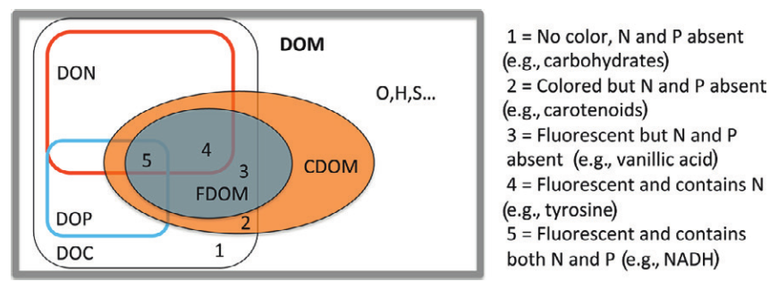
</center>
<small>Graphic from @Stedmon2015b</small>

- Fraction of the organic matter smaller than 0.2 µm.
- 1500+ different compounds observed [@Seitzinger2005].
- Present in all aquatics ecosystems.

## Dissolved organic matter

The carbon fraction (DOC) is the major part of the bioreactive fraction of the dynamic carbon pool on Earth.

<center>
  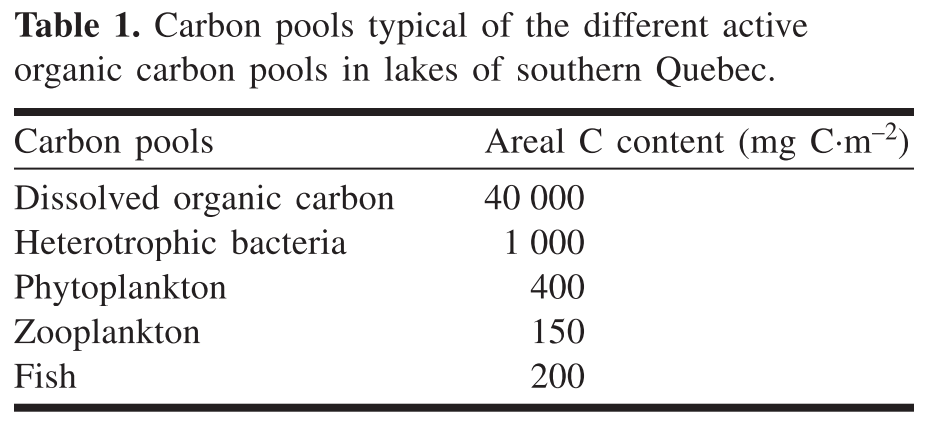
</center>
<small>From @Prairie2008</small>

## Dissolved organic matter

Important driver of ecosystem functionning:

1. Carbon content (DOC): main source of metabolic substrate for bacteria (*microbial loop*).

<center>
  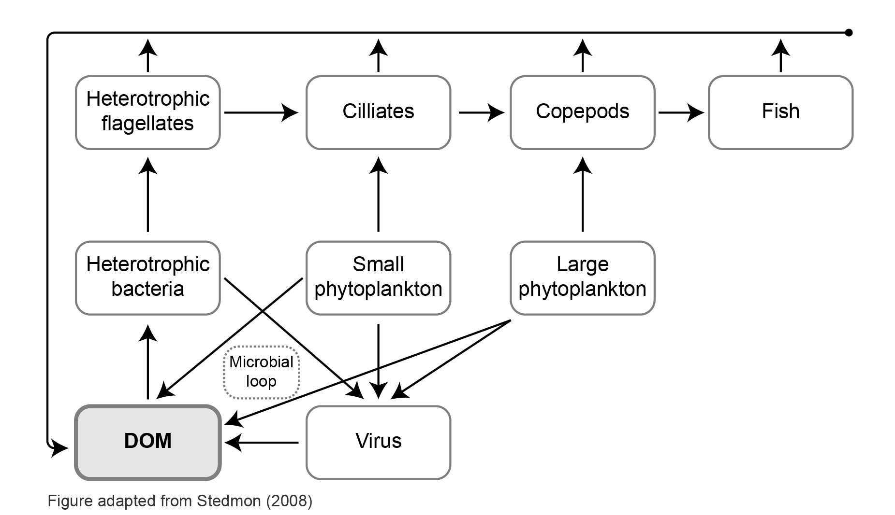
</center>

2. The chromophoric fraction (CDOM) is a major driver of underwater light characteristics (*primary production, photochemistry, UV protection*).

## Dynamics of DOM

Many processes of transformation and production acting simultaneously.

<center>
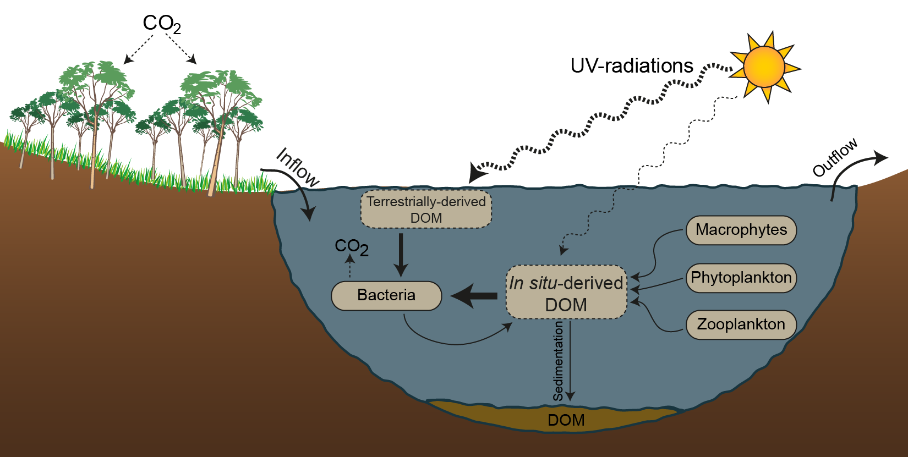
</center>

## Area of active research

```{r, echo = FALSE, fig.height=5, warning=FALSE, message=FALSE, fig.align='center'}

files <- list.files("data/", full.names = TRUE)

df <- lapply(files, read_delim, delim = "\t")

df <- lapply(df, function(x) data.frame(lapply(x, as.character), stringsAsFactors = FALSE)) %>% 
  bind_rows()

df %>% 
  group_by(PY) %>% 
  summarise(n = n()) %>% 
  mutate(year = as.numeric(PY)) %>% 
  filter(year < 2017) %>% 
  ggplot(aes(x = year, y = n)) +
  geom_point() +
  geom_smooth() +
  xlab("Year") +
  ylab("Number of publication") +
  labs(title = "Number of articles containing 'dissolved organic matter' in their title", 
       caption = "Source: Web of Science")


```


## Current context

In recent decades, climate changes, eutrophication and changes in land use have contributed to increased inputs of colored terrestrial DOM in aquatic ecosystems [@Roulet2006; @Haaland2010; @Massicotte2013RSE; @Weyhenmeyer2014].

## Impacts of brownification

> This has important consequences since the transformation of even a small fraction of the DOM pool can potentially have large impacts on ecosystem functioning [@Prairie2008].

<br>

Increases in CO2 emissions [@Lapierre2013] and reduction in primary production due to light shading [@Thrane2014; @Seekell2015] have already been documented as consequences of increases in terrestrial DOM at local and regional scales.

## Effect on primary production

<center>
  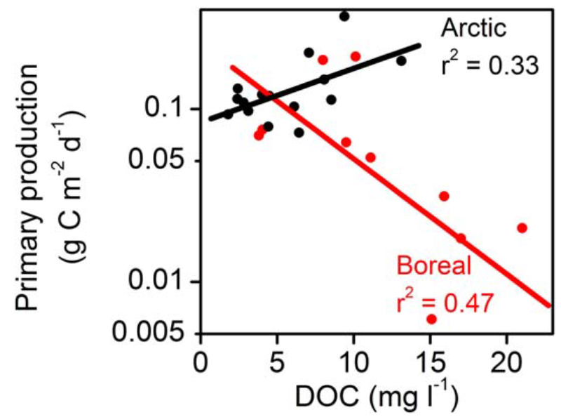
</center>
<small>Graphic from @Seekell2015</small>

## Problematic

- Generalizing the effects of *brownification* to global scales is a difficult task because *our current understanding on the fate and dynamics of DOM along the complete aquatic continuum gradient (from headwater lakes to oceans) is limited*.

<br>

- Most studies about DOM dynamics are either site of ecosystem specific: *currently impossible to have an overview at the global scale*.

## Literature data at the rescue

- DOC (*proxy for DOM quantity*) and CDOM (*proxy for DOM quality*) properties are now routinely measured in many ecological studies.

<br>

- This creates an opportunity to explore the factors regulating the dynamic of the DOM pool at global scale.

## Absorption of CDOM

CDOM absorption can be used to characterize the DOM pool.

```{r, echo = FALSE, fig.height=4}

panels <- c(antarctic = "Antarctic",
            massicotte2011 = "St-Lawrence River")

df1 <- read_feather("../dataset/clean/complete_profiles/massicotte2011.feather")

df2 <- read_feather("../dataset/clean/complete_profiles/antacrtic.feather")

bind_rows(df1, df2) %>%
  filter(wavelength >= 250 & wavelength <= 500) %>%
  ggplot(aes(x = wavelength, y = absorption, group = unique_id)) +
  geom_line(size = 0.25) +
  facet_wrap(~study_id, labeller = labeller(study_id = panels)) +
  xlab("Wavelength (nm)") +
  ylab(bquote("Absorption" ~(m^{-1})))

```

## The project

Use all available data to explore the dynamic of DOM around the world.

<center>
  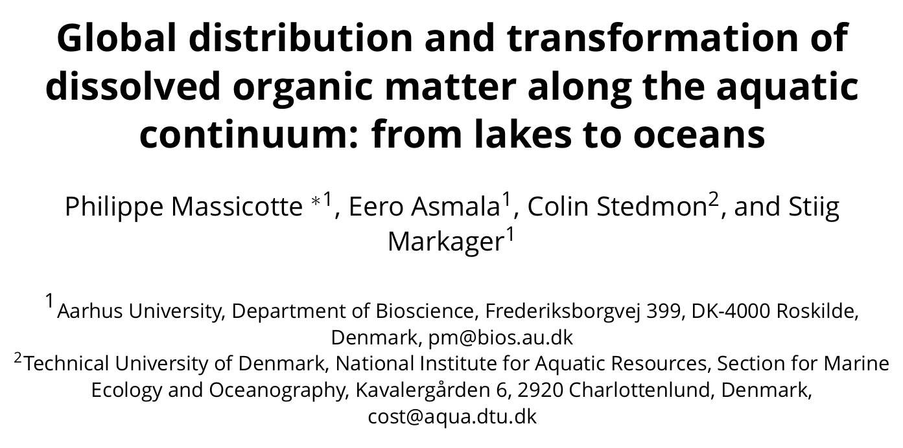
</center>
<small>Submitted to Limnology & Oceanography</small>

## The data

Gather and analyze all available data containing both DOC and CDOM measurements.

<center>
  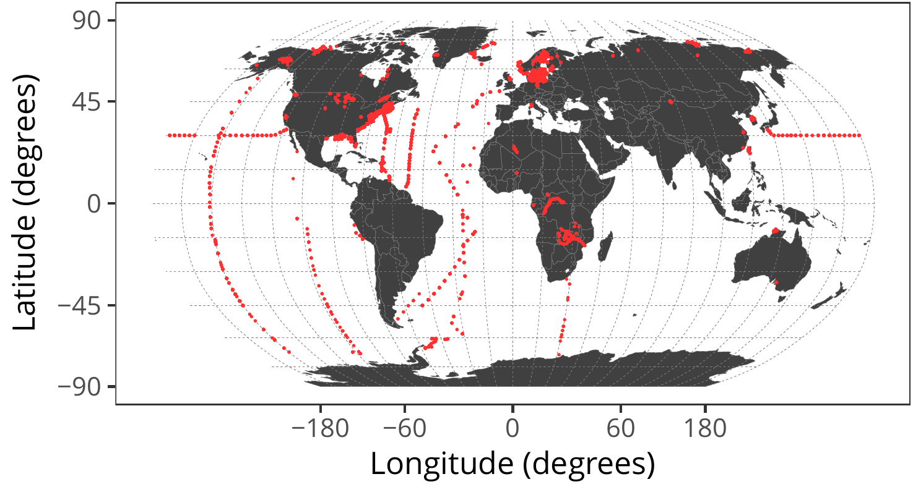
</center>
<small>World map showing the spatial distribution of the observations extracted from the literature (*n = 13 032* on ~70 studies conducted between 1990 and 2015).</small>

## Spatial distribution

<center>
  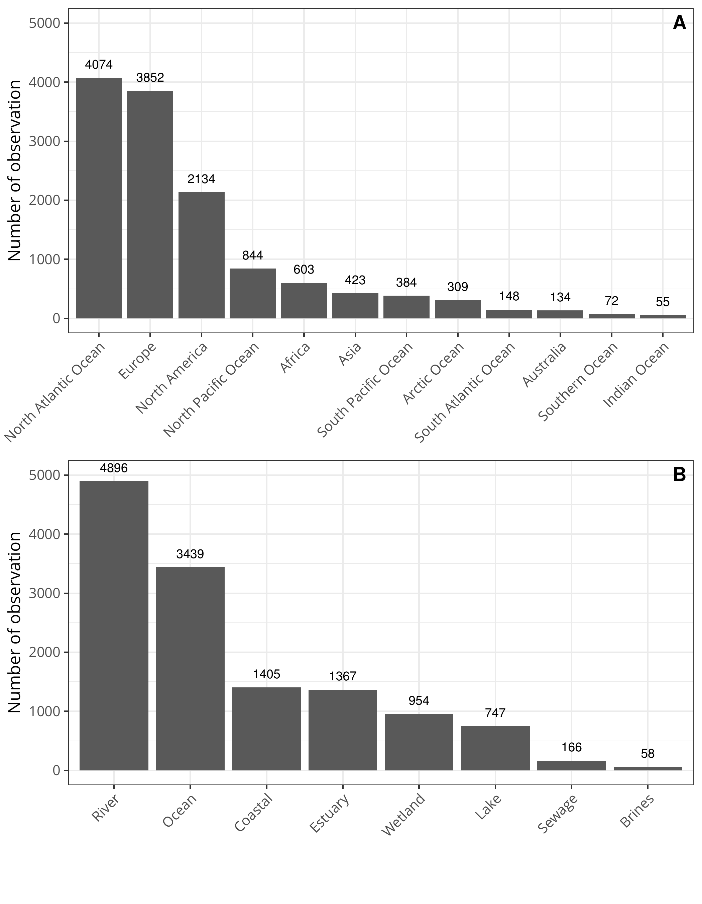
</center>
<small>Barplot showing the number of unique observations for (**A**) principal regions and (**B**) ecosystems.</small>

## Lack of concensus

Absorption of CDOM is reported at different wavelengths.

```{r, echo = FALSE, fig.height=4}

df <- read_feather("../dataset/clean/complete_data_350nm.feather") %>%
  group_by(wavelength) %>%
  summarise(n = n())

df %>%
  ggplot(aes(x = reorder(wavelength, -n), y = n)) +
  geom_bar(stat = "identity") +
  scale_y_log10() +
  annotation_logticks(side = "l") +
  xlab("Wavelength (nm)") +
  ylab("Number of observations")

```

## A bit of methodology

<center>
  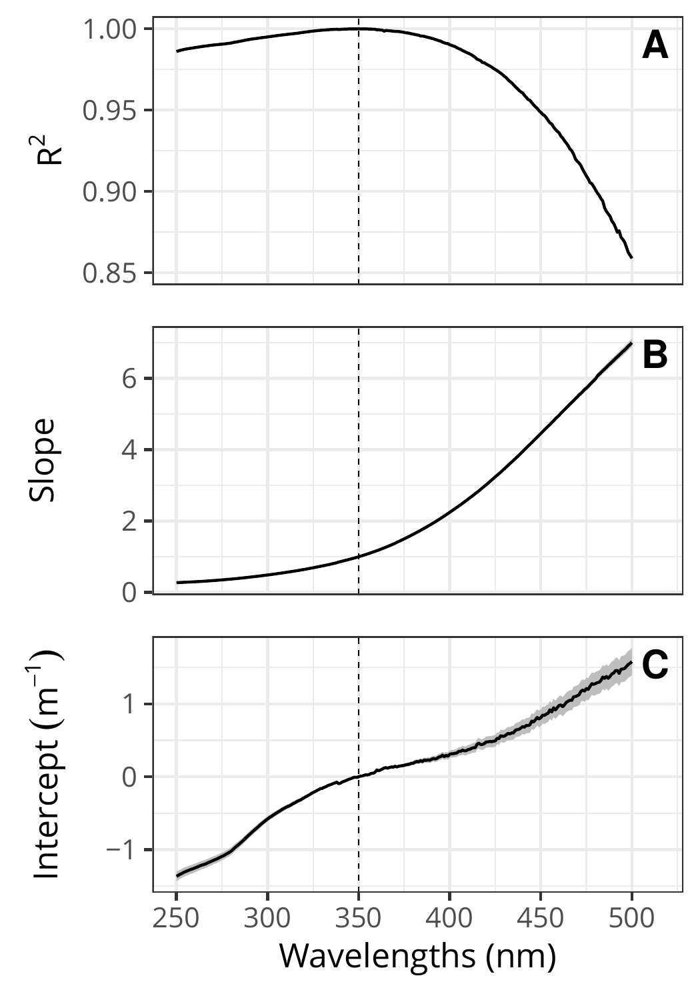
</center>
<small>Results of the linear regressions between $a_{CDOM}(350)$ and $a_{CDOM}(\lambda)$.</small>

## Why 350 nm?

We decided to choose 350 nm has the reference wavelength.

<center>
  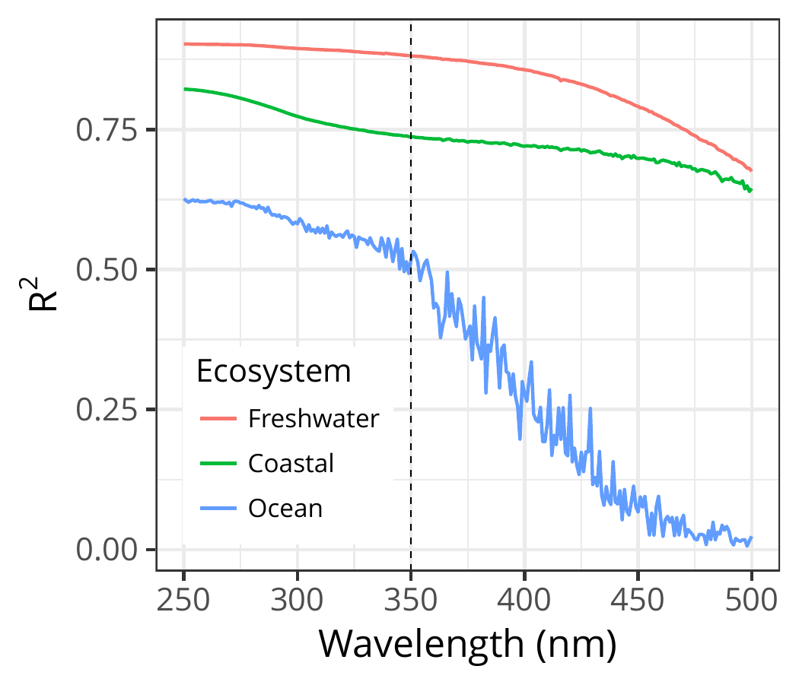
</center>
<small>Determination coefficient (R2) showing the goodness of the linear fit between DOC and absorption coefficients measured at different wavelengths.</small>

## Ecosystem overview

<center>
  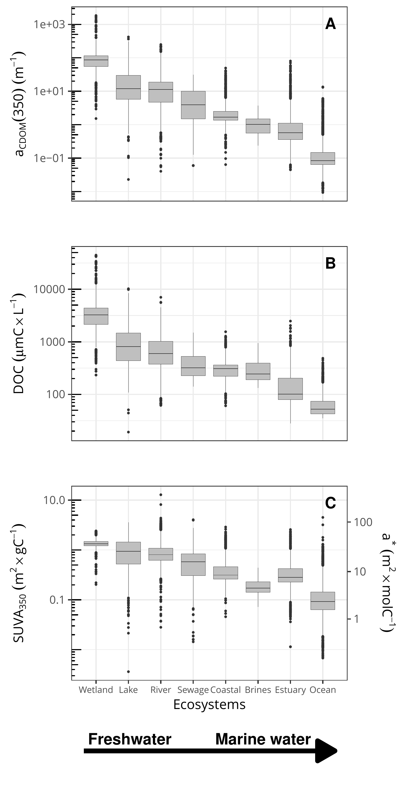
</center>

## DOC vs aCDOM

Strong relationship at global scale.

<center>
  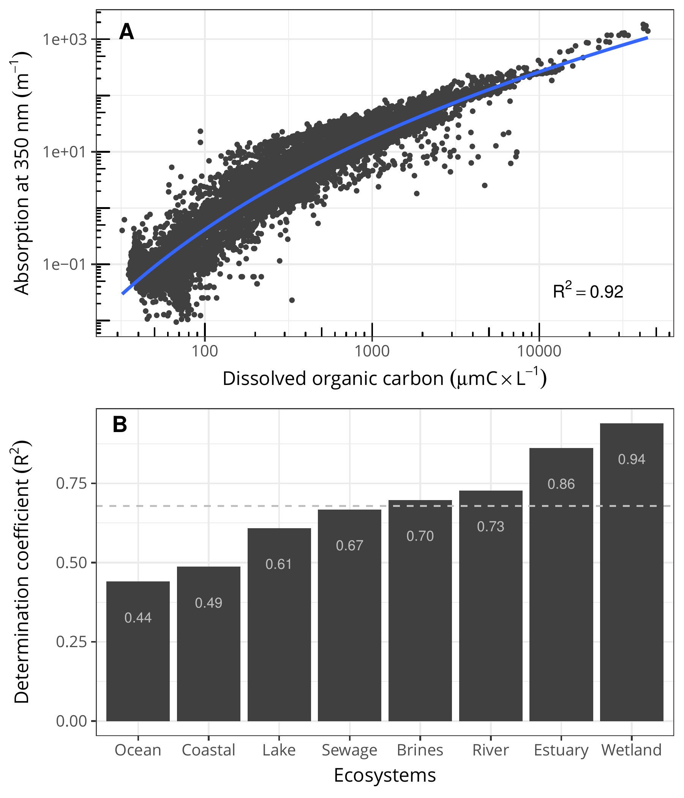
</center>
<small>(**A**) Global relationship between absorption at 350 nm a CDOM (350) and dissolved organic carbon. (**B**) Barplot showing the determination coefficient (R2) of the linear relationships between a CDOM (350) and DOC by ecosystems. The dashed horizontal line represents the average of R2.</small>

## DOC vs aCDOM

Relationship highly variable among ecosystems.

<center>
  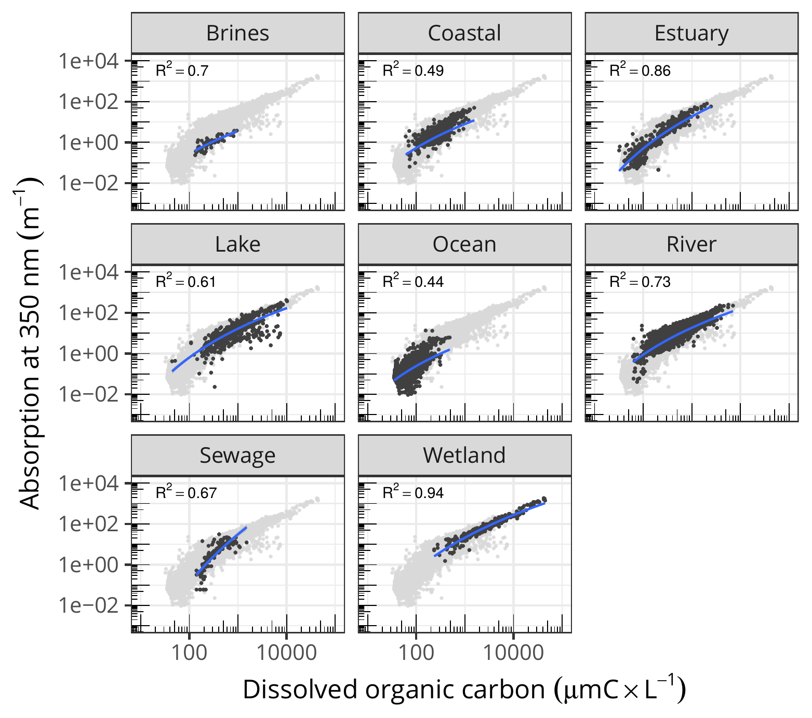
</center>

## DOM reactivity

Strong bi-linear pattern along the spatial gradient (*inland water $\rightarrow$ open ocean*).

<center>
  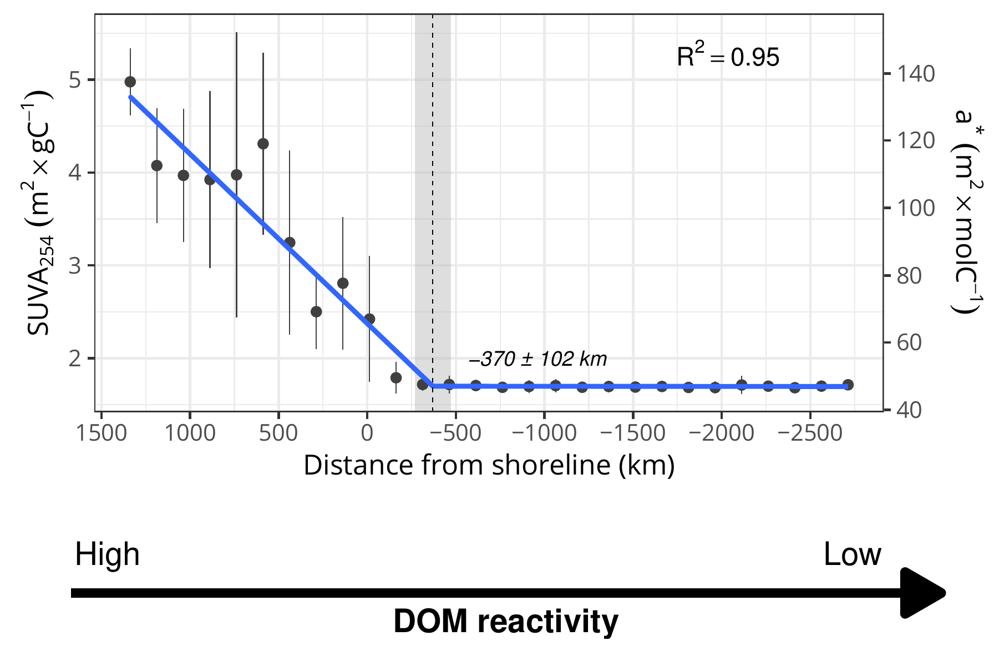
</center>
<small>Averaged SUVA254 calculated using observations from river and ocean ecosystems as a function of the distance to the closest shoreline. Positive distances represent inland samples (rivers) whereas negative distances represent oceanic samples.</small>

## DOM reactivity

Over a distance of 4000 km, a piecewise linear regression showed that the observed decrease of SUVA occurred more than 1300 times faster in freshwater ecosystems compared to marine water ecosystems, suggesting that degradation processes preferentially CDOM over DOC.

## Buffer zone

Active processing of DOM around continents.

<center>
  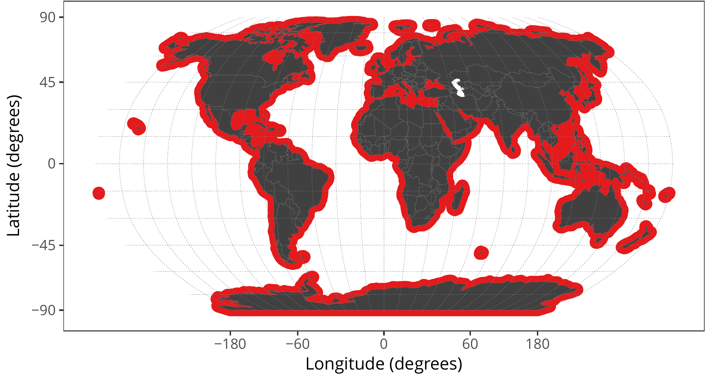
</center>
<small>World map showing the 370 km buffer zone identified by the segmentation analysis.</small>

## DOM dynamic in oceans

More than just conservative mixing.

<center>
  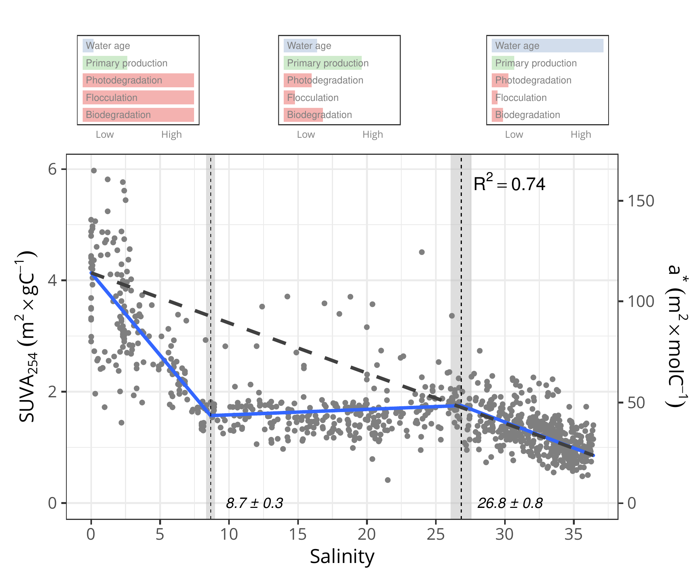
</center>
<small>Segmentation analysis performed on the linear relationship between SUVA254 and salinity.</small>

## CDOM spectra: freshwater vs ocean

> @Loiselle2009 developed an approach to characterize the absorption characteristics of CDOM. This method, based on the derivative signal of the absorption signal, allows to determine the wavelength intervals where there are changes in the spectral slope.

## CDOM spectra: freshwater vs ocean

<center>
  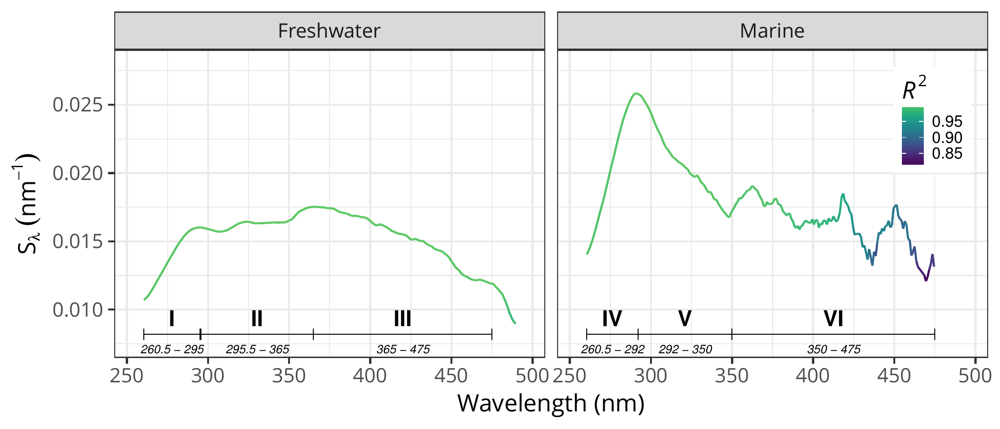
</center>
<small>Spectral slope curve (Sλ) calculated on averaged absorption spectra on freshwater and marine ecosystems using a 21 nm wavelength interval. R2 for the calculated fit is indicated by color for each point on the spectrum.</small>

## Take home messages

> - Our results show that as the DOM pool transited toward the oceans, the robustness of the observed relation decreased rapidly (R2 from 0.94 to 0.44) indicating a gradual decoupling between DOC and acdom350 as the connectivity between the landscape and its aquatic component decreased along the aquatic continuum.

> - The observed change in the DOM characteristics along the aquatic continuum suggests that the terrestrial DOM pool is gradually becoming less reactive, which can have profound consequences on cycling of organic carbon in aquatic ecosystems.

## Limitations (1/2)

1. Southern hemisphere aquatic ecosystems (*n = 1047; 8%*) are higly under represented.

<center>
  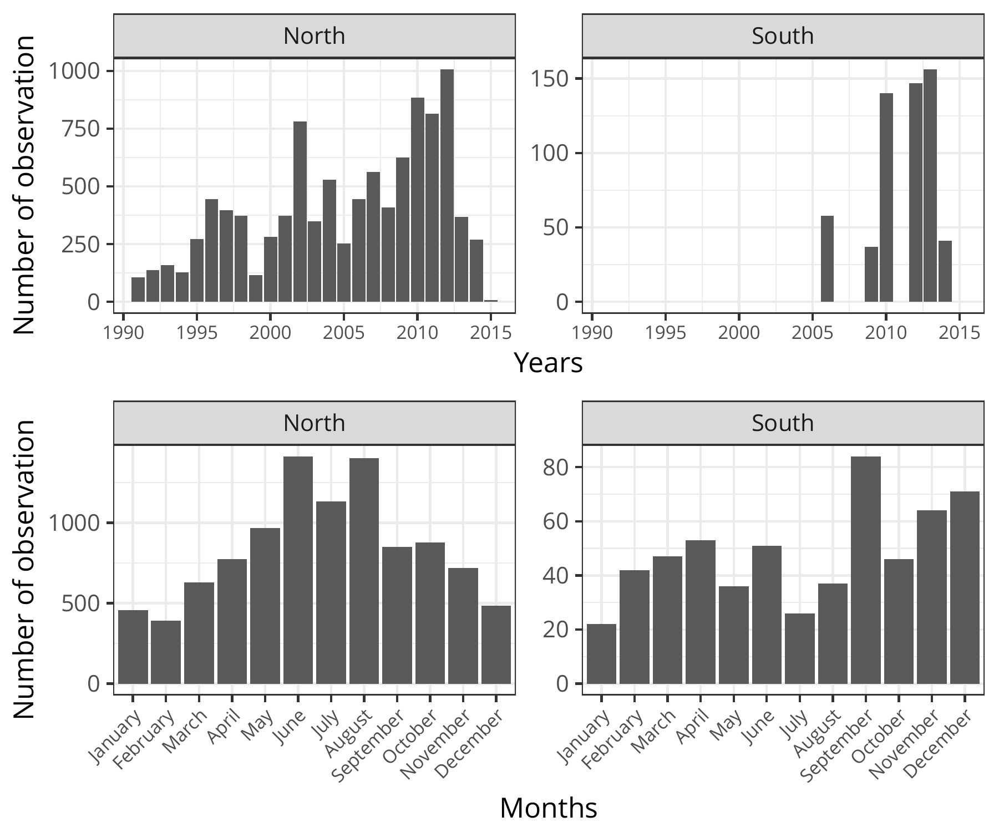
</center>

## Limitations (2/2)

2. The majority of samples are taken during summer. Because this correspond the productive season with maximum primary production, this might lead to bias towards autochthonous signal.

<center>
  
</center>

## Data access

> Collecting the dataset used in this study has shown that there are shortcomings in the CDOM community in making the scientific data openly available.

While we fully acknowledge the considerable amount of work and funds used to acquire the data, it is vital to emphasize the importance of making spectral data available in open access databases so that the data collected can continue to contribute to progress in the field.

## Data access

One of the first steps to make the data available (*after a reasonable period of exclusive use*) would be to use the existing data portals such as:

1. Pangaea (https://www.pangaea.de/)

2. DRYAD (http://datadryad.org/)

## Data access

Make your data open and reproductible!

> I can't find the data anymore...

## References {.refsection}
