```{r setup, include=FALSE}
knitr::opts_chunk$set(echo = FALSE)

library(tidyverse)
library(feather)
library(extrafont)

loadfonts(quiet = TRUE)

theme_set(theme_bw(base_size = 12, base_family = "Open Sans"))

system("sh png.sh")
```

<center>
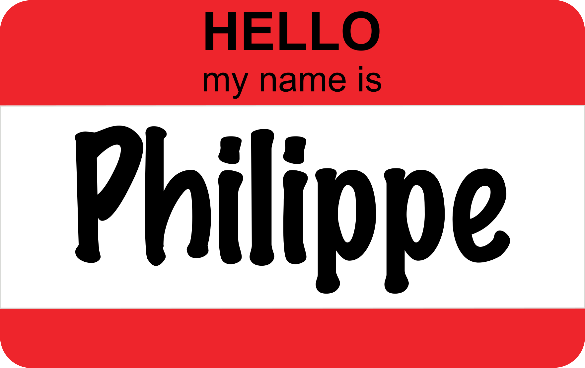
</center>

philippe.massicotte@takuvik.ulaval.ca

## Dissolved organic matter

What is **D**issolved **O**rganic **M**atter (DOM)?

<center>
  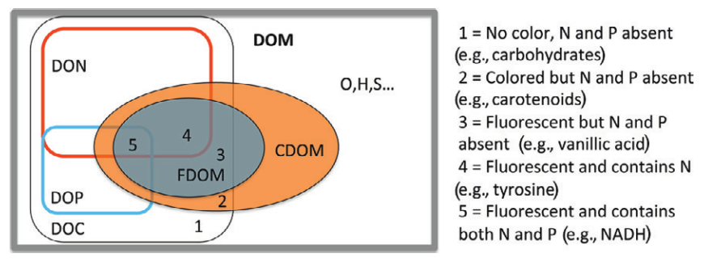
</center>
<small>Graphic from @Stedmon2015b</small>

- Fraction of the organic matter smaller than 0.2 µm.
- 4000+ different compounds observed [@Stubbins2014].
- Present in all aquatics ecosystems.

## Dissolved organic matter

Important driver of water color in freshwater ecosystems

<center>
  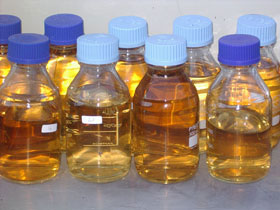
</center>

## Dissolved organic matter

Its composition depend on landscape configuration

<center>
  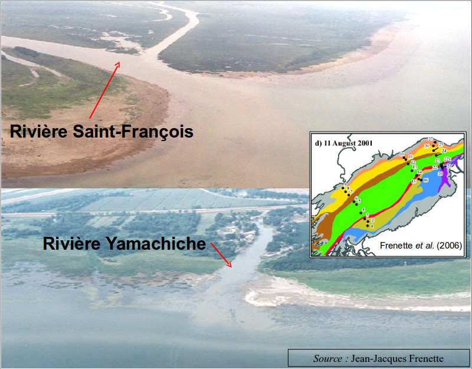
</center>

## Dissolved organic matter

The carbon fraction (DOC) is the major part of the bioreactive fraction of the dynamic carbon pool on Earth.

<center>
  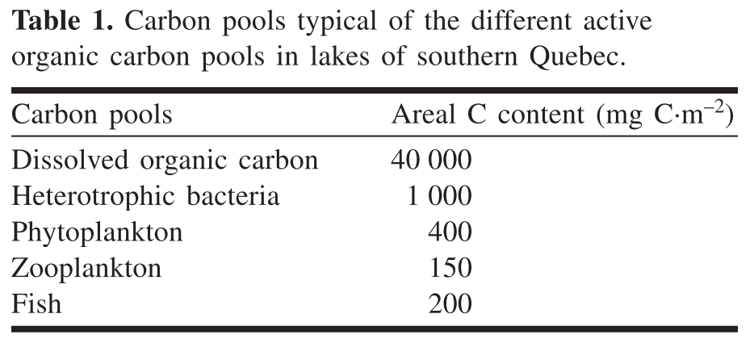
</center>
<small>From @Prairie2008</small>

## Dissolved organic matter

Important driver of ecosystem functioning:

1. Carbon content (DOC): main source of metabolic substrate for bacteria (*microbial loop*).

<center>
  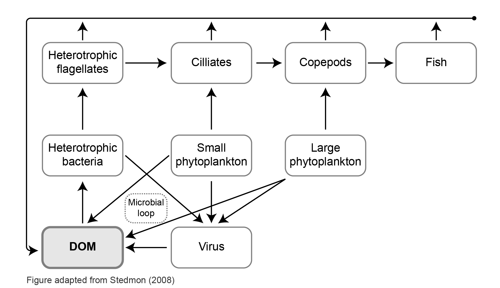
</center>

2. The chromophoric fraction (CDOM) is a major driver of underwater light characteristics (*primary production, photochemistry, UV protection*).

## Characterization of DOM

4000+ chemical compounds, but two main groups:

<br>

| **Terrestrial origin**                             | **Aquatic origin**                        |
|----------------------------------------------------|-------------------------------------------|
| Degradation of soil organic matter (erosion, etc.) | In situ primary production (phyto, macro) |
| Older than aquatic DOM                             | "Fresher" than terrestrial DOM            |
| Humic and fulvic compounds                         | Fulvic, proteins and amine acids          |
| High molecular weight (> 1 kDa)                    | Low molecular weight (< 1 kDa)            |
| Low bioavailability for bacteria                   | High bioavailability for bacteria         |

## Dynamics of DOM

Many processes of transformation and production acting simultaneously.

<center>
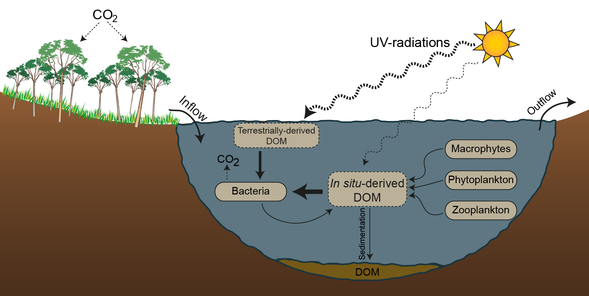
</center>

## Area of active research

```{r npublication, echo = FALSE, fig.height=5, warning=FALSE, message=FALSE, fig.align='center'}

files <- list.files("data/", full.names = TRUE)

df <- lapply(files, read_delim, delim = "\t")

df <- lapply(df, function(x) data.frame(lapply(x, as.character), stringsAsFactors = FALSE)) %>%
  bind_rows()

df %>%
  group_by(PY) %>%
  summarise(n = n()) %>%
  mutate(year = as.numeric(PY)) %>%
  filter(year < 2017) %>%
  ggplot(aes(x = year, y = n)) +
  geom_point() +
  geom_smooth() +
  xlab("Year") +
  ylab("Number of publication") +
  labs(title = "Number of articles containing 'dissolved organic matter' in their title",
       caption = "Source: Web of Science")


```

## Current context

**Brownification of aquatic ecosystems**

In recent decades, climate changes, eutrophication and changes in land use have contributed to increased inputs of colored terrestrial DOM in aquatic ecosystems [@Roulet2006; @Haaland2010; @Massicotte2013RSE; @Weyhenmeyer2014].

<center>
  
</center>
<small>https://domqua.no/</small>

## Current context

**Brownification of aquatic ecosystems**

<center>
  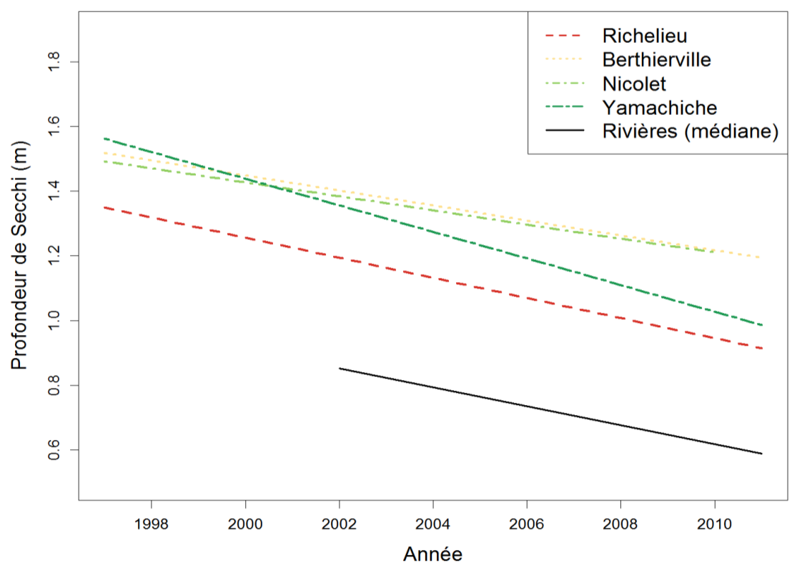
</center>
<small>Project: "Relation lumière-macrophytes au LSP" (Dr. Raphael Proulx UQTR)</small>

## Impacts of brownification

> This has important consequences since the transformation of even a small fraction of the DOM pool can potentially have large impacts on ecosystem functioning [@Prairie2008].

<br>

Increases in CO2 emissions [@Lapierre2013] and reduction in primary production due to light shading [@Thrane2014; @Seekell2015] have already been documented as consequences of increases in terrestrial DOM at local and regional scales.

## Effect on primary production

<center>
  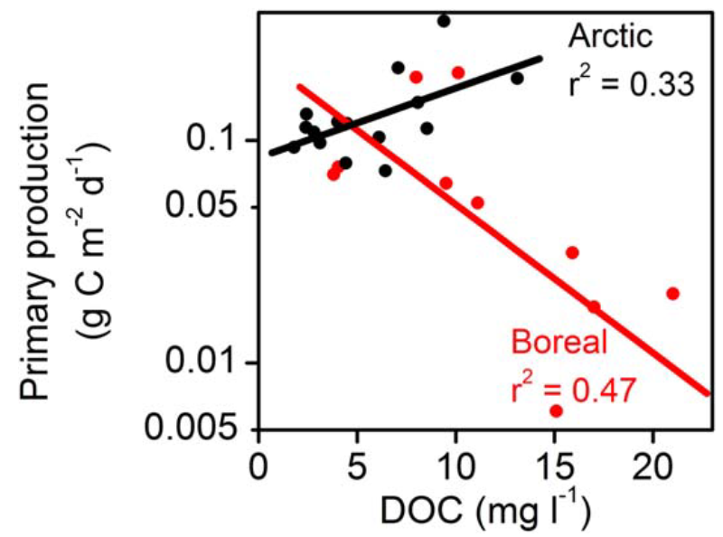
</center>
<small>Graphic from @Seekell2015</small>

## Problematic

<br>

- Generalizing the effects of *brownification* to global scales is a difficult task because *our current understanding on the fate and dynamics of DOM along the complete aquatic continuum gradient (from headwater lakes to oceans) is limited*.
    - Most studies about DOM dynamics are either site of ecosystem specific.

## Literature data at the rescue

- DOC (*proxy for DOM quantity*) and CDOM (*proxy for DOM quality*) properties are now routinely measured in many ecological studies.

```{r , echo = FALSE, fig.height=3, warning=FALSE, message=FALSE, fig.align='center'}

files <- list.files("data/", full.names = TRUE)

df <- lapply(files, read_delim, delim = "\t")

df <- lapply(df, function(x) data.frame(lapply(x, as.character), stringsAsFactors = FALSE)) %>%
  bind_rows()

df %>%
  group_by(PY) %>%
  summarise(n = n()) %>%
  mutate(year = as.numeric(PY)) %>%
  filter(year < 2017) %>%
  ggplot(aes(x = year, y = n)) +
  geom_point() +
  geom_smooth() +
  xlab("Year") +
  ylab("Number of publication") +
  labs(title = "Number of articles containing 'dissolved organic matter' in their title",
       caption = "Source: Web of Science")


```

- This creates an opportunity to explore the factors regulating the dynamic of the DOM pool at global scale.

## The project

**Objective:** Use all available data to explore the dynamic of DOM around the world.

<center>
  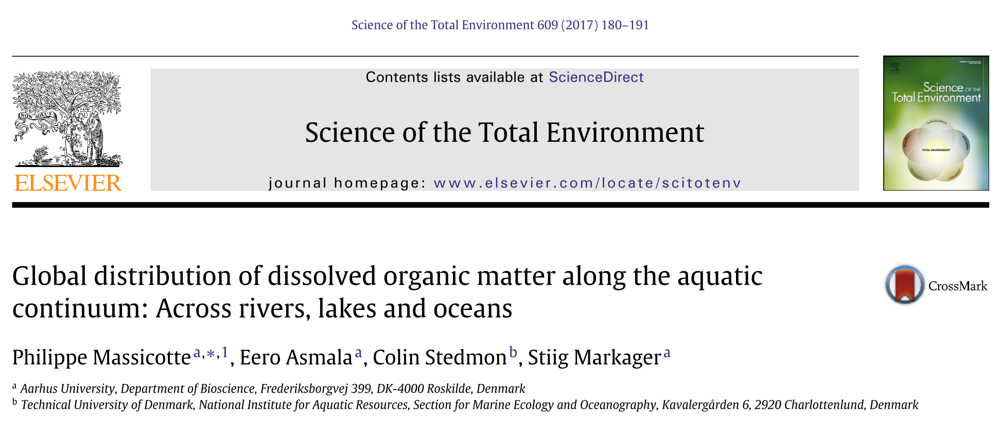
</center>

## The data

Step #1: Gather all available data containing both DOC and CDOM measurements.

<br>

Web of Science, Google Scholar as well as public data repositories were searched using terms *cdom*, *doc*, *dissolved organic carbon*, *absorption* and *dissolved organic matter* for datasets presenting original (i.e. not summarized) values of DOC and absorption properties of CDOM.

## Spatial overview

<br>

<center>
  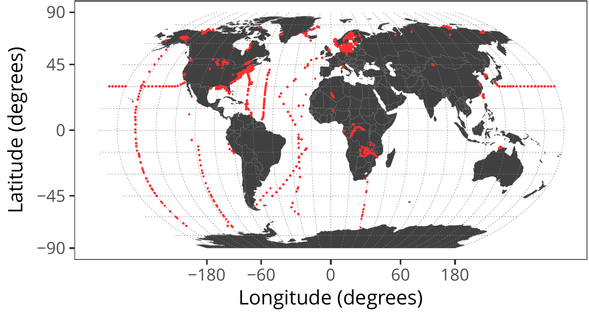
</center>
<small>World map showing the spatial distribution of the observations extracted from the literature (*n = 13 032* on *~70 studies* conducted between 1990 and 2015).</small>

## Spatial distribution

<center>
  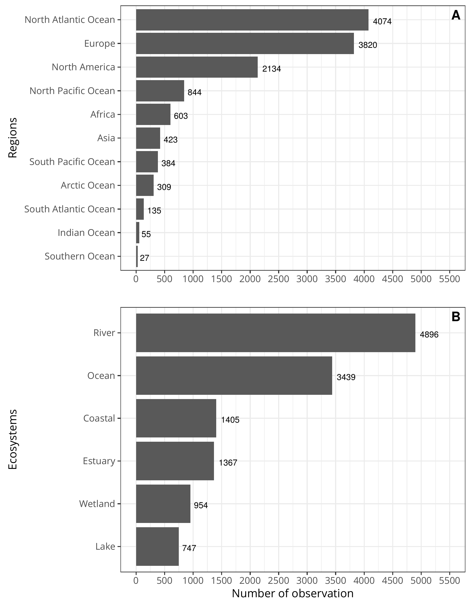
</center>
<small>Barplot showing the number of unique observations for (**A**) principal regions and (**B**) ecosystems.</small>

## Absorption of CDOM

CDOM absorption can be used to characterize the DOM pool.

```{r, echo = FALSE, fig.height=4}

panels <- c(greenland_lakes = "Greenland lakes",
            massicotte2011 = "St-Lawrence River")

df1 <- read_feather("../../dataset/clean/complete_profiles/massicotte2011.feather")

df2 <- read_feather("../../dataset/clean/complete_profiles/greenland_lakes.feather")

bind_rows(df1, df2) %>%
  filter(wavelength >= 250 & wavelength <= 500) %>%
  ggplot(aes(x = wavelength, y = absorption, group = unique_id)) +
  geom_line(size = 0.25) +
  facet_wrap(~study_id, labeller = labeller(study_id = panels)) +
  xlab("Wavelength (nm)") +
  ylab(bquote("Absorption" ~(m^{-1})))

```

## Lack of concensus

Absorption of CDOM is reported at different wavelengths.

```{r, echo = FALSE, fig.height=4}

df <- read_feather("../../dataset/clean/complete_data_350nm.feather") %>%
  group_by(wavelength) %>%
  summarise(n = n())

df %>%
  ggplot(aes(x = reorder(wavelength, -n), y = n)) +
  geom_bar(stat = "identity") +
  scale_y_log10() +
  annotation_logticks(side = "l") +
  xlab("Wavelength (nm)") +
  ylab("Number of observations")

```

## A bit of methodology

Step #2: estimate the value of $a_{\text{CDOM}}(350)$

```{r, echo=FALSE, fig.height=4, fig.align='center'}

library(ggpmisc)

df <- read_feather("../../dataset/clean/cdom_dataset.feather") %>%
  select(unique_id, wavelength, absorption) %>%
  filter(wavelength %in% c(275, 350, 600)) %>%
  spread(wavelength, absorption, sep = "_") %>%
  drop_na()

my.formula <- y ~ x

p1 <- df %>%
  ggplot(aes(x = wavelength_275, y = wavelength_350)) +
  geom_point() +
  geom_smooth(method = "lm", formula = my.formula) +
  xlab(bquote(a[CDOM](275)~(m^{-1}))) +
  ylab(bquote(a[CDOM](350)~(m^{-1}))) +
  stat_poly_eq(formula = my.formula,
               aes(label = paste(..eq.label.., ..rr.label.., sep = "~~~")),
               parse = TRUE)

p2 <- df %>%
  ggplot(aes(x = wavelength_600, y = wavelength_350)) +
  geom_point() +
  geom_smooth(method = "lm") +
  xlab(bquote(a[CDOM](600)~(m^{-1}))) +
  ylab(bquote(a[CDOM](350)~(m^{-1}))) +
  stat_poly_eq(formula = my.formula,
               aes(label = paste(..eq.label.., ..rr.label.., sep = "~~~")),
               parse = TRUE)

cowplot::plot_grid(p1, p2)
```


## A bit of methodology

<center>
  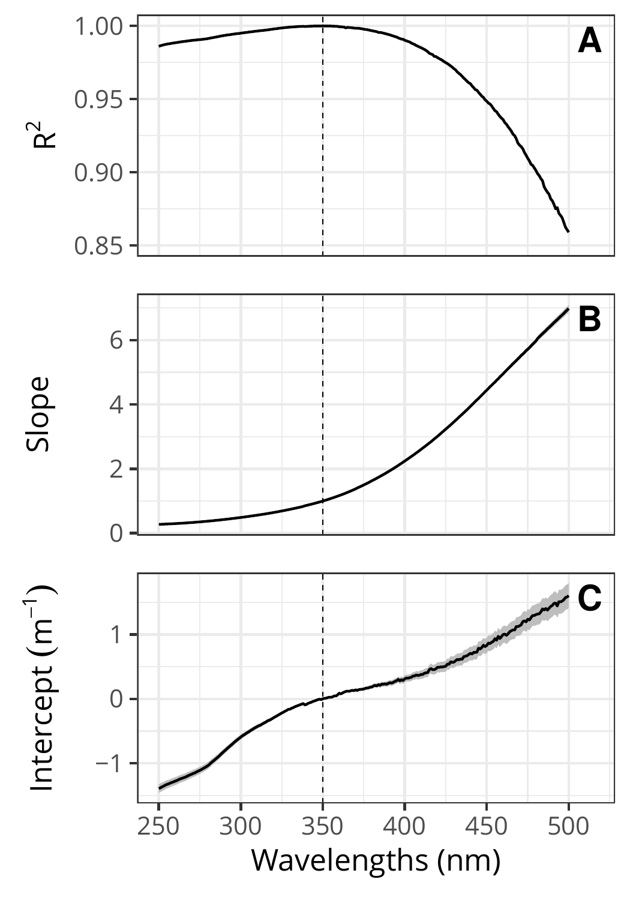
</center>
<small>Results of the linear regressions between $a_{\text{CDOM}}(350)$ and $a_{\text{CDOM}}(\lambda)$.</small>

## Why 350 nm?

We decided to choose 350 nm has the reference wavelength because $a_{\text{CDOM}}(350)$ was well correlated to DOC concentration.

<center>
  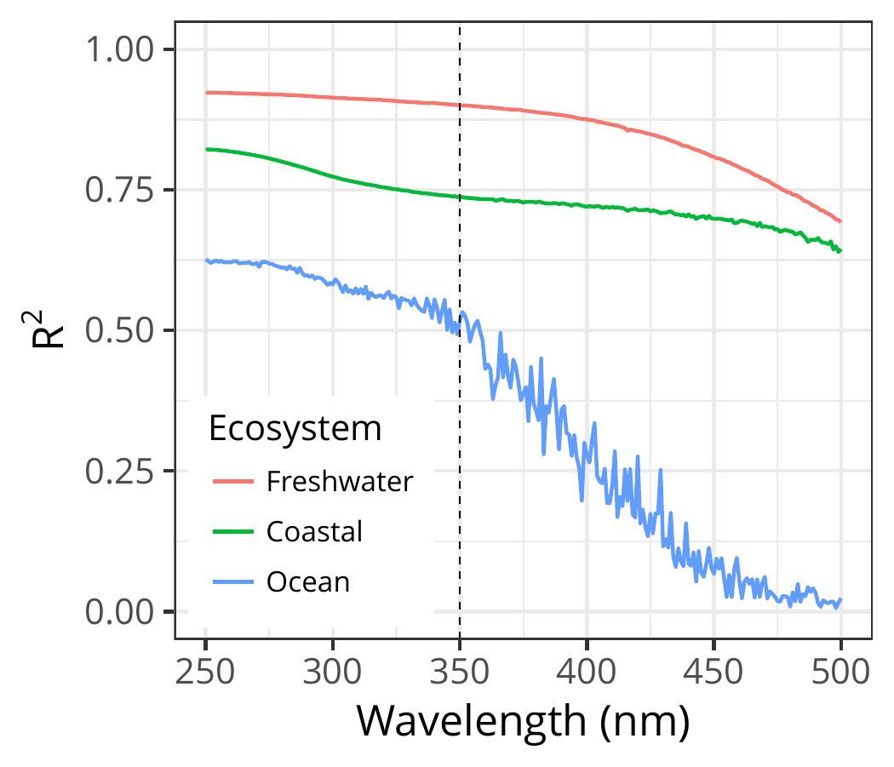
</center>
<small>Determination coefficient (R2) showing the goodness of the linear fit between DOC and absorption coefficients measured at different wavelengths ($a_{\text{CDOM}}(\lambda)$).</small>

## Ecosystem overview

<center>
  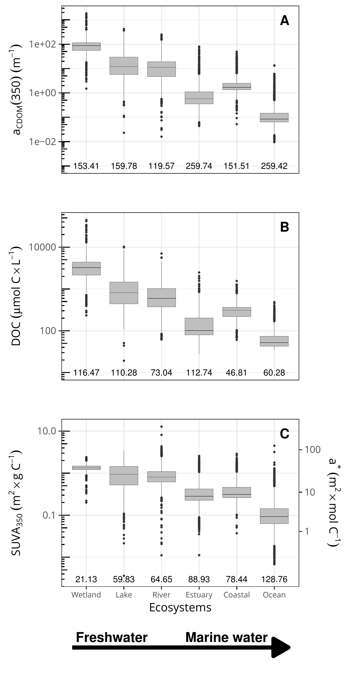
</center>

## DOC vs aCDOM

Strong relationship at global scale.

<center>
  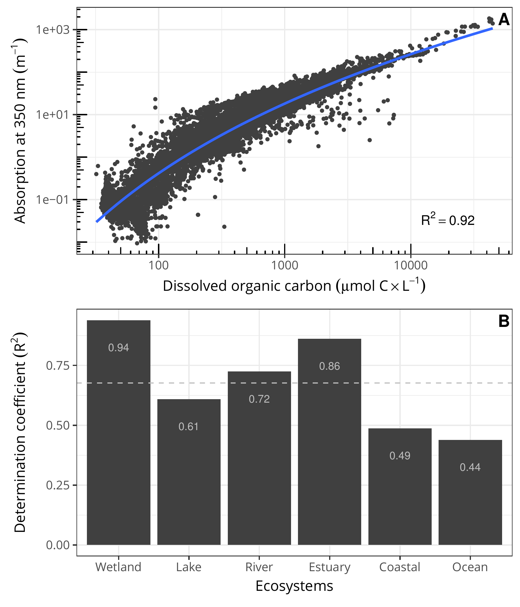
</center>
<small>(**A**) Global relationship between absorption at 350 nm a CDOM (350) and dissolved organic carbon. (**B**) Barplot showing the determination coefficient (R2) of the linear relationships between a CDOM (350) and DOC by ecosystems. The dashed horizontal line represents the average of R2.</small>

## DOC vs aCDOM

Relationship highly variable among ecosystems.

<center>
  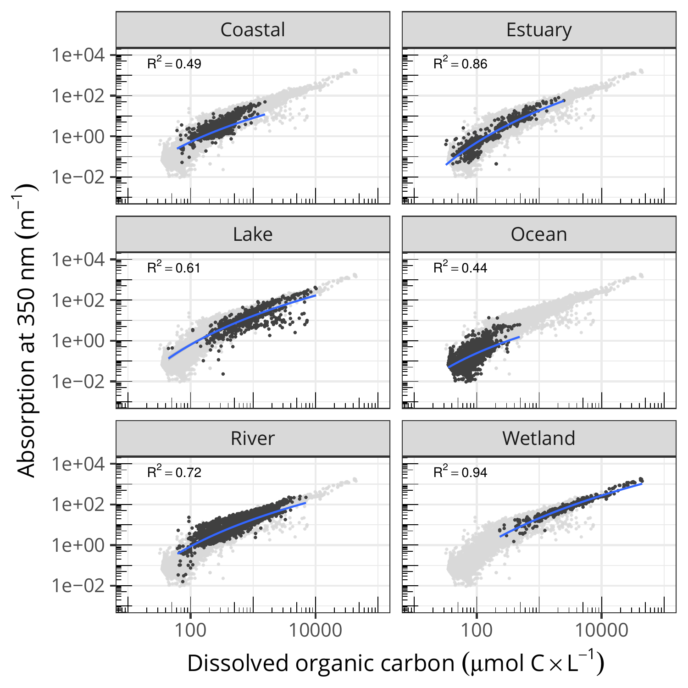
</center>

## DOM reactivity

*How to characterize DOM reactivity along the aquatic continuum?*

DOC-specific UV absorbance at 254 nm ($\text{SUVA}_{254}$) is a good proxy for estimating DOM reactivity [@Weishaar2003].

<br>

$$
\text{SUVA}_{254} = \frac{a_{\text{CDOM}}(254)~[m^{-1}]}{\text{DOC}~[mg \times L^{-1}]}
$$

## DOM reactivity

<center>
  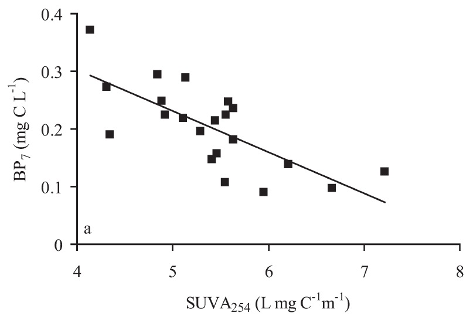
</center>
<small>Figure from @Berggren2009</small>

SUVA is inversely proportional to the biodegradability of DOM: increasing SUVA values indicate a more aromatic and less biodegradable DOM pool.

## DOM reactivity

*Is DOM reactivity present any kind of spatial pattern?* For each sample, we calculated its distance to the closest shoreline.

<center>
  
</center>
<small>Positive values = inland water, negative values = ocean water</small>


## DOM reactivity

Strong bi-linear pattern along the spatial gradient (*inland water $\rightarrow$ open ocean*).

<center>
  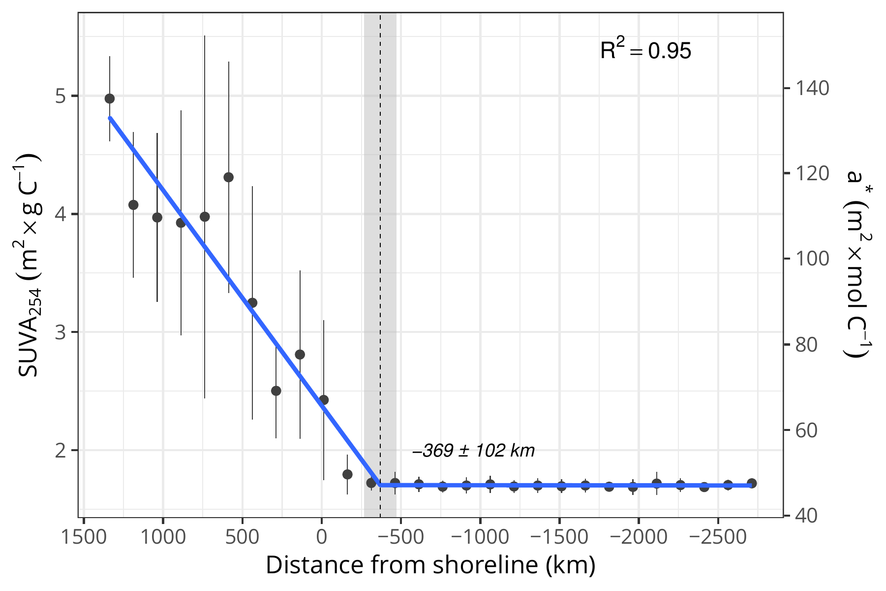
</center>
<small>Averaged SUVA254 calculated using observations from river and ocean ecosystems as a function of the distance to the closest shoreline. Positive distances represent inland samples (rivers) whereas negative distances represent oceanic samples.</small>

## DOM reactivity

Over a distance of 4000 km, a piecewise linear regression showed that the observed decrease of SUVA occurred more than 1300 times faster in freshwater ecosystems compared to marine water ecosystems, *suggesting that degradation processes act preferentially CDOM over DOC*.

## DOM dynamic in oceans

More than just conservative mixing.

<center>
  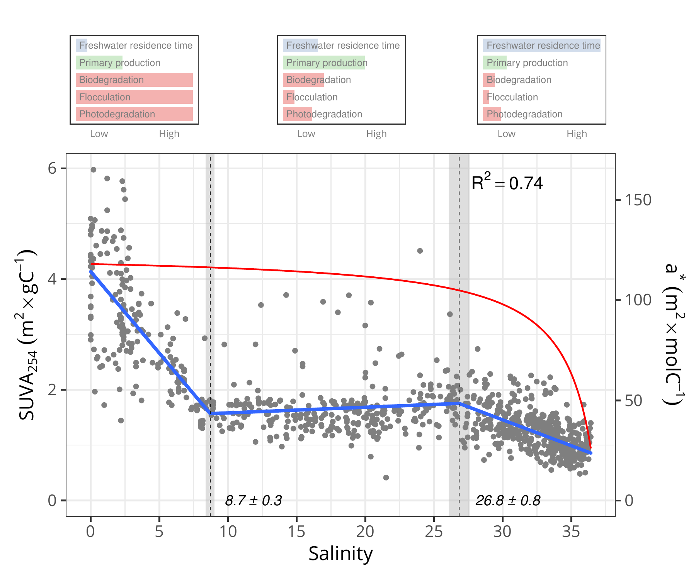
</center>
<small>Segmentation analysis performed on the linear relationship between SUVA254 and salinity.</small>

## Absorption by CDOM

How different are spectra between open ocean and freshwater?

```{r, echo = FALSE, fig.height=4}

panels <- c(arctic = "Arctic",
            massicotte2011 = "St-Lawrence River")

df1 <- read_feather("../../dataset/clean/complete_profiles/massicotte2011.feather")

df2 <- read_feather("../../dataset/clean/complete_profiles/arctic.feather")

bind_rows(df1, df2) %>%
  filter(wavelength >= 250 & wavelength <= 500) %>%
  ggplot(aes(x = wavelength, y = absorption, group = unique_id)) +
  geom_line(size = 0.25) +
  facet_wrap(~study_id, labeller = labeller(study_id = panels)) +
  xlab("Wavelength (nm)") +
  ylab(bquote("Absorption" ~(m^{-1})))

```

## Absorption by CDOM

@Loiselle2009 developed an approach to characterize the absorption characteristics of CDOM. This method, based on the derivative signal of the absorption signal, *allows to determine the wavelength intervals where there are changes in the spectral slope*.

## Absorption by CDOM

<center>
  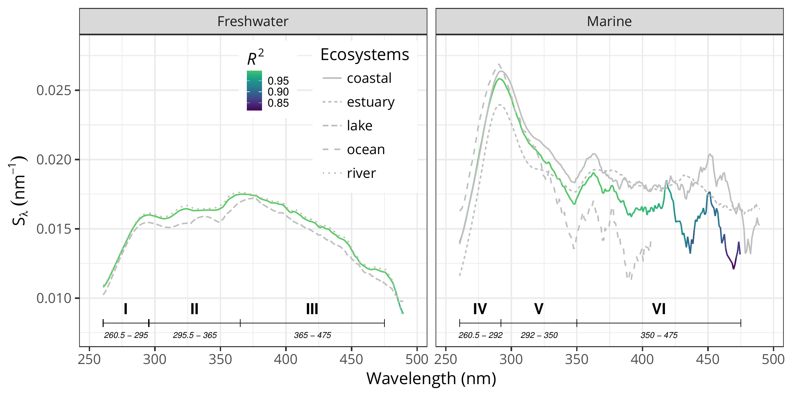
</center>
<small>Spectral slope curve (Sλ) calculated on averaged absorption spectra on freshwater and marine ecosystems using a 21 nm wavelength interval. R2 for the calculated fit is indicated by color for each point on the spectrum.</small>

## Take home messages

> - Our results show that as the DOM pool transited toward the oceans, the robustness of the observed relation decreased rapidly ($R^2$ from 0.94 to 0.44) indicating a gradual decoupling between DOC and $a_{\text{cdom}}(350)$ as the connectivity between the landscape and its aquatic component decreased along the aquatic continuum.

<br>

> - The observed change in the DOM characteristics along the aquatic continuum suggests that the terrestrial DOM pool is gradually becoming less reactive, which can have profound consequences on cycling of organic carbon in aquatic ecosystems.

## Limitations (1/2)

1. Southern hemisphere aquatic ecosystems (*n = 1047; 8%*) are highly under represented.

<center>
  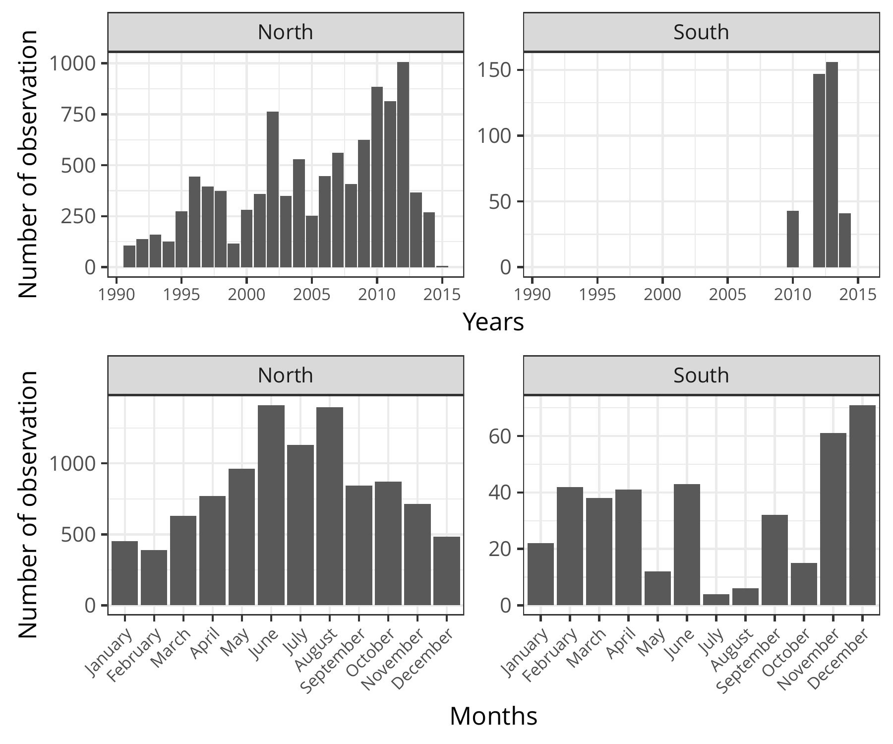
</center>

## Limitations (2/2)

2. The majority of samples are taken during summer. Because this correspond the productive season with maximum primary production, this might lead to bias towards autochthonous signal.

<center>
  
</center>

## Data access

> Collecting the dataset used in this study has shown that there are shortcomings in the CDOM community in making the scientific data openly available.

While we fully acknowledge the considerable amount of work and funds used to acquire the data, *it is vital to emphasize the importance of making data available in open access databases so that the data collected can continue to contribute to progress in the field*.

## Data access

One of the first steps to make the data available (*after a reasonable period of exclusive use*) would be to use the existing data portals such as:

1. Pangaea (https://www.pangaea.de/)

2. DRYAD (http://datadryad.org/)

3. Nature recommended data repositories (http://www.nature.com/sdata/policies/repositories#envgeo)

4. Zenodo (https://zenodo.org/)

## Data access

Please make your data processing and analysis reproducible!

> I can't find the data anymore...

<center>
  
</center>

<center>
  
</center>


## References {.refsection}
